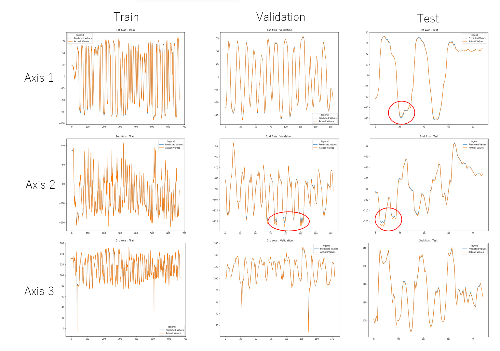

# Pose_Recognition_of_Human-Robot_Dance

**Project Ip (Island Performance): The Creation Plan Based on the Translation of Techno Art Scene and Cross-Disciplinary Collaboration - Matsu Islands as a Demo Site.**

 
 
 * Demo of Skeleton Recognition by MediaPipe
 
 

 * Demo of Time Series Forecasting by LSTM

   

  * Predicted Value and Actual Value of LSTM
  
  **The root mean squared error of each axis are 0.68, 0.73, and 4.01 in validation, respectively.**
  
  ##The Loss between Predicted Value and Actual Value are negligibly small 

# Raccoon_hiwin_GH_plug-in

Create Hrb is a Grasshopper plug-in that translates the KUKA-robot-language files generated by KUKA|prc into the file format for HIWIN robots, allowing the workflow for HIWIN robots to be integrated into KUKA|prc.

****
**Example File Preview (RacCoon_HIWIN_v221008) :**

**(Select Hiwin Robot)**  
It support RA620-1739 & RT605-710-GB on current version.

**(Change the Color of Robot)**

**(Create .hrb file)**

****

**We accept no responsibility for damage or injury, so please check your hrb file carefully before running.**  

For instructions on installing Grasshopper Add-Ons, please see:
https://www.food4rhino.com/en/faq#users-install-grasshopper-plugin  
